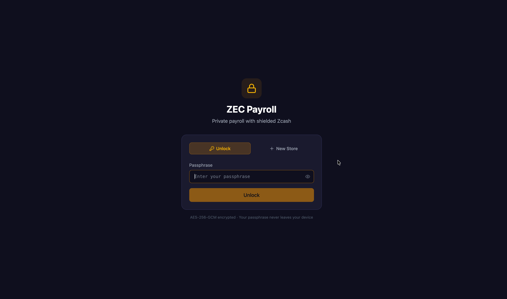
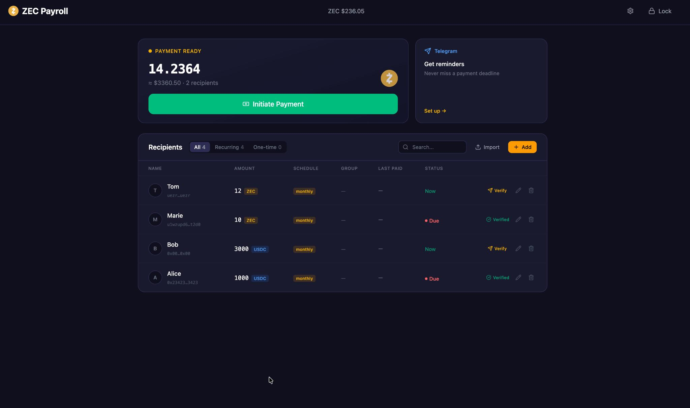
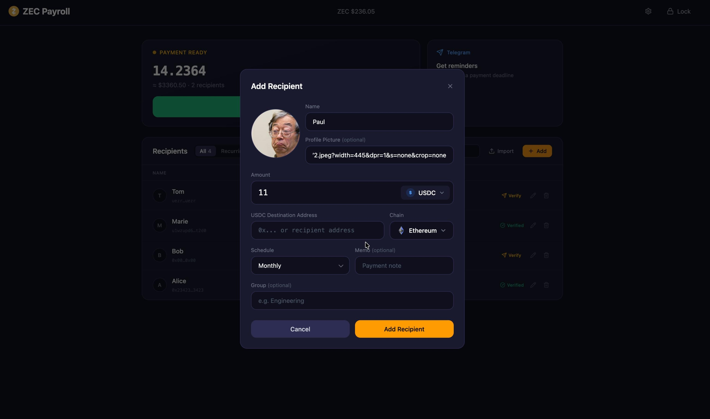
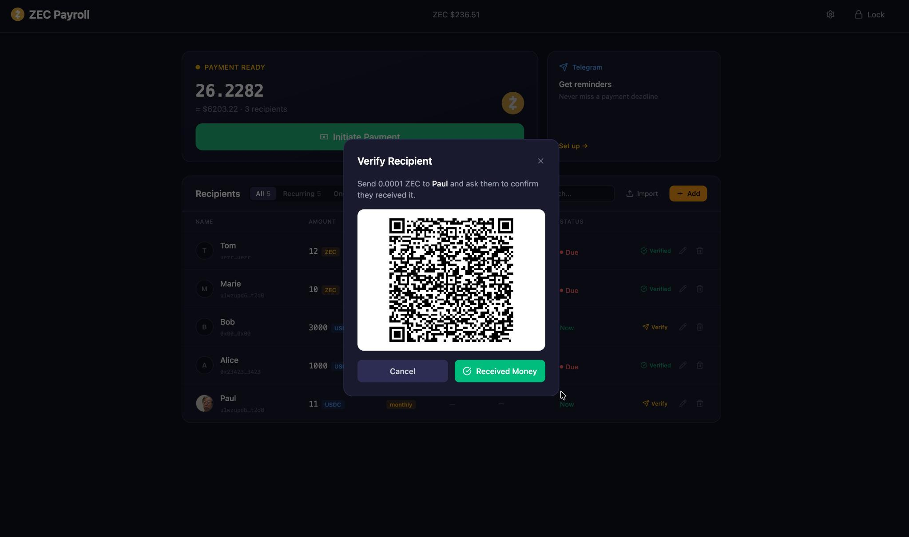
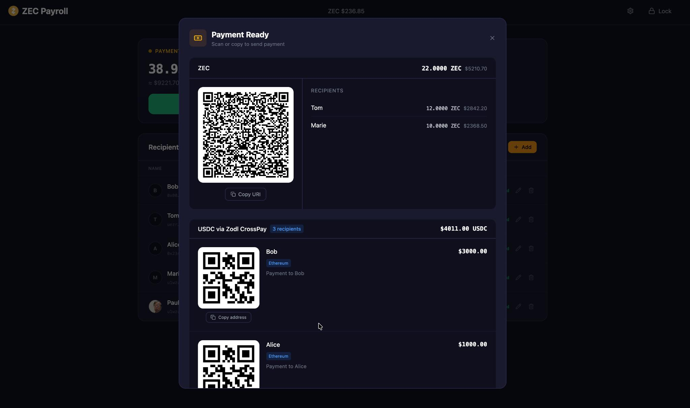

# ZEC Payroll

**Live app**: https://web-production-9dda3.up.railway.app/

A privacy-focused payroll management system that enables organizations to pay contributors with shielded Zcash (ZEC). Provides both a CLI tool and a modern web dashboard for managing recipients, scheduling payments, and generating ZIP-321 payment URIs.

All sensitive data (recipient details, wallets, memos) is encrypted end-to-end using a user-controlled passphrase that is never stored on the server.

## Screenshots

| | |
|---|---|
|  |  |
|  |  |
|  | |

## Tech Stack

**Backend**: Node.js, TypeScript, Prisma ORM, PostgreSQL
**Frontend**: React 19, TypeScript, Vite, Tailwind CSS
**Deployment**: Railway.app (Nixpacks)

## Features

### Vault & Authentication

- Passphrase-based encryption using AES-256-GCM with scrypt key derivation
- No password storage — only an encrypted probe is kept for trial decryption
- Multi-vault support for multiple organizations on the same instance

### Recipient Management

- Add, edit, and delete recipients with fully encrypted storage
- Search bar to filter recipients by name
- Support for shielded Zcash addresses (Sapling or Unified)
- Multiple payment currencies: ZEC, USD, USDC
- USDC recipients include a destination address and chain (Ethereum, Solana, NEAR, Base, Arbitrum, Polygon)
- Custom payment memos and avatar URLs
- CSV import/export with merge mode (updates existing recipients by name, adds new ones)

### Payment Scheduling

- **Weekly**, **Biweekly**, **Monthly**, and **One-time** payment schedules
- Automatic "due" calculation based on last paid date
- Payment history tracking per recipient

### ZIP-321 Payment URIs

- Generates multi-recipient payment URIs following the ZIP-321 standard
- Batch payments to multiple recipients in a single URI
- Base64url-encoded memo support
- QR code generation for mobile wallet scanning

### Price Conversion

- Real-time ZEC/USD price fetching from CoinGecko
- Cached price with offline fallback
- Automatic USD-to-ZEC conversion
- Manual price override

### USDC Payouts (via Zodl CrossPay)

- Recipients can choose USDC as their payment currency with a destination address on any supported chain (Ethereum, Solana, NEAR, Base, Arbitrum, Polygon)
- At payment time, USDC recipients are separated from the ZIP-321 batch and displayed as individual CrossPay instructions
- The admin uses Zodl's CrossPay feature to send each USDC payment: shielded ZEC is spent from the admin's wallet and the recipient receives USDC on their chosen chain via NEAR intents
- USDC address and chain are stored encrypted alongside other sensitive recipient data

### Test Transactions

- Send small test transactions (0.0001 ZEC) to verify wallet addresses before including recipients in payroll batches
- Track test transaction status and confirmation per recipient

### Telegram Notifications

- Biweekly scheduled reminders (every other Monday at 9 AM UTC)
- Automatic notifications when payments are due
- Configurable per vault with encrypted settings

### Batch Payment Processing

- Generate batch ZIP-321 URIs for ZEC/USD recipients
- USDC recipients displayed as individual CrossPay instruction cards with address, chain, and amount
- Preview mode showing total ZEC, USD equivalent, and recipient count
- Confirmation flow that marks recipients as paid and records payment history

## Project Structure

```
zcash-payroll/
├── server/                  # Node.js backend (API + CLI)
│   ├── src/
│   │   ├── api.ts           # HTTP server (port 3141)
│   │   ├── cli.ts           # CLI command interface
│   │   ├── db.ts            # Database layer (Prisma + encryption)
│   │   ├── crypto.ts        # AES-256-GCM encryption utilities
│   │   ├── zip321.ts        # ZIP-321 payment URI generation
│   │   ├── schedule.ts      # Payment scheduling logic
│   │   ├── csv.ts           # CSV import/export
│   │   ├── price.ts         # ZEC price fetching (CoinGecko)
│   │   ├── telegram.ts      # Telegram notification integration
│   │   └── test-e2e.ts      # End-to-end tests
│   └── prisma/
│       └── schema.prisma    # Database schema (PostgreSQL)
├── web/                     # React/TypeScript frontend
│   ├── src/
│   │   ├── App.tsx          # Main dashboard
│   │   ├── components/      # UI components
│   │   └── lib/api.ts       # API client & types
│   └── vite.config.ts
├── sample.csv               # Sample recipient data
└── package.json             # Monorepo root (workspaces)
```

## Getting Started

### Prerequisites

- Node.js
- PostgreSQL

### Local Development

```bash
# Install dependencies
npm install

# Set up the database
export DATABASE_URL="postgresql://..."
npx prisma migrate dev --schema=server/prisma/schema.prisma

# Terminal 1: API server
npm run dev:server

# Terminal 2: Web frontend
npm run dev:web
```

### Environment Variables

| Variable             | Description                          | Required |
| -------------------- | ------------------------------------ | -------- |
| `DATABASE_URL`       | PostgreSQL connection string         | Yes      |
| `TELEGRAM_BOT_TOKEN` | Telegram bot token for notifications | No       |
| `VITE_API_URL`       | API server URL for the web frontend  | No       |

## CLI Usage

```bash
zcash-payroll init                  # Create a new vault
zcash-payroll import <csvFile>      # Import recipients from CSV
zcash-payroll list                  # List all recipients
zcash-payroll add                   # Interactively add a recipient
zcash-payroll remove <name>         # Remove a recipient
zcash-payroll preview               # Preview batch payment
zcash-payroll set-price <usd>       # Manually set ZEC price
zcash-payroll pay                   # Generate ZIP-321 URIs and mark paid
zcash-payroll status                # Show payroll status
zcash-payroll test-tx [name]        # Generate test transaction URIs
zcash-payroll confirm-test <name>   # Mark test tx as confirmed
```

## API Endpoints

### Auth
- `GET /api/generate-passphrase` — Generate a diceware-style passphrase
- `POST /api/init` — Create a new vault
- `POST /api/unlock` — Unlock vault with passphrase
- `POST /api/lock` — Clear session
- `GET /api/status` — Check session status

### Recipients
- `GET /api/recipients` — List all recipients
- `POST /api/recipients` — Add/update a recipient
- `GET /api/recipients/<name>` — Get recipient details + history
- `PUT /api/recipients/<name>` — Update recipient fields
- `DELETE /api/recipients/<name>` — Remove a recipient

### CSV
- `GET /api/sample-csv` — Download sample CSV template
- `POST /api/import` — Import recipients from CSV

### Payments
- `GET /api/price` — Fetch current ZEC/USD price
- `POST /api/price` — Manually set ZEC/USD price
- `GET /api/preview` — Preview batch payment
- `POST /api/pay` — Generate ZIP-321 URIs (ZEC) + CrossPay instructions (USDC)
- `POST /api/confirm-pay` — Mark recipients as paid

### Test Transactions
- `POST /api/test-tx` — Generate test tx URI
- `POST /api/confirm-test` — Mark test tx as confirmed

### Telegram
- `GET /api/telegram` — Get Telegram config
- `POST /api/telegram` — Set Telegram config
- `POST /api/telegram/test` — Send test notification

### Schedule
- `GET /api/schedule` — Get all recipients' payment status

## Encryption & Security

- **Algorithm**: AES-256-GCM (authenticated encryption)
- **Key Derivation**: scrypt (32-byte salt, 32-byte key)
- **Encrypted fields**: name, wallet address, memo, avatar URL, USDC address, USDC chain, Telegram config
- **Not encrypted**: amount, currency, schedule (needed for queries)
- **Passphrase verification**: Trial decryption of a known probe string

## License

MIT
